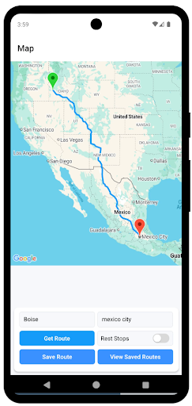

**Rest Stop App** Version 1.0

**User Manual** 

**Dev Team: Caleb Backer, Tully Martin, Max Ma** 

CS 402   
Date: Spring 2025  

Overview 

This semester, our team created an app that we expect will be easy and simple to use. When using the app, users will see two prompts indicating origin and destination.  When finished, enter the selected city , press the get route button. Users will have virtual routes being made on the map. And while the route being generated , users can enable toggle for rest stops to see all the rest stops being generated in that specific route. Users also are able to see the specification of rest stops differentiated by different colors. To save the route, users can simply press the save route button to rename and save the personalized route. To view the saved route, users can simply press view saved routes button.

To use: 

1\. Go to [https://expo.dev](https://expo.dev) to create a personal account.

2\. Go to the Snacks sidebar on the left and to create New Snack.

3\. After a new snack is created, go to the project directory on the left, select three dots and import the git repository.

4\. Put the URL [https://github.com/CalebBacker/Route-app-react-native.git](https://github.com/CalebBacker/Route-app-react-native.git) to import the github repository. 

5\. Depending on the version the user currently has, dependency installation may be needed.

6\. Click on my device if the user prefers to run the app on a personal device by scanning QR code, click on Android or iOS if the user prefers to run the app.

  
In this screen, users can select origin and destination from example “Boise” to “Mexico City” and press get route to generate a route.

After enabling the rest stop toggle, the user can see a list of rest stops in the generated route.  

When ready to save selected route press “Save Route” button, alert prompt pop up for personalized route name

To view saved route, press “View Saved Routes” button to check the routes been saved  

